# homework-monitoring

Описание домашнего задания
---
1. Настроить дашборд с 4-мя графиками

память;

процессор;

диск;

сеть.

Использование систем, примеры которых не рассматривались на занятии*

---
ОС для настройки: ubuntu 22_04

Система мониторигна - Grafana

БД для метрик - InfluxDB

Сбор метрик - telegraf агент

---
- Этап 1: Установка БД

В качестве БД для хранения метрик решил использовать инфлюкс. Скачиваем и устанавливаем БД

```bash
wget https://dl.influxdata.com/influxdb/releases/influxdb_1.8.10_amd64.deb

dpkg -i influxdb_1.8.10_amd64.deb
  systemctl enable influxdb
  sudo chown -R influxdb:influxdb /var/lib/influxdb/
  systemctl start influxdb
``` 

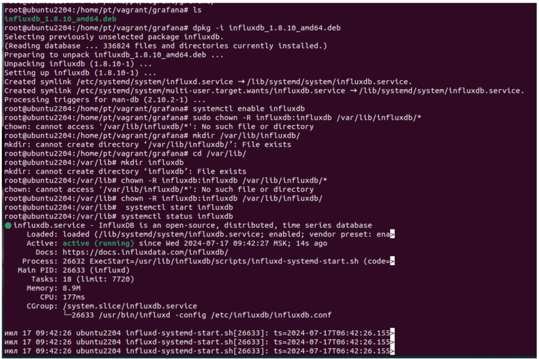


**Создаем саму базу**, в которую будут складываться метрики

```bash
  influx
  CREATE DATABASE OTUS WITH DURATION 30d
  show databases
  exit
``` 

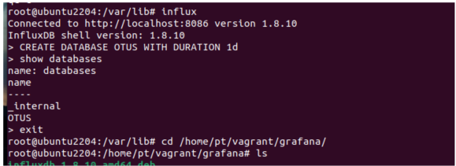

---
- Этап 2: Устанавливаем **telegraf агента** для сбора нужных метрик 

```bash
 wget https://dl.influxdata.com/telegraf/releases/telegraf_1.22.3-1_amd64.deb
dpkg -i telegraf_1.22.3-1_amd64.deb
``` 

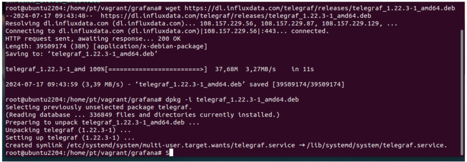

Далее необходимо установить правильного пользователя. Лезем в 

```bash
/lib/systemd/system/telegraf.service
# И меняем на root
``` 

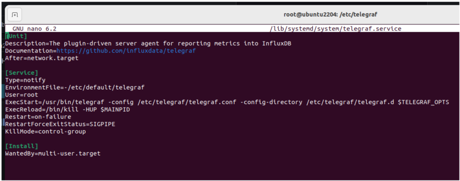


**Создаем конфигурационный файл** в 

```bash
/etc/telegraf/telegraf.d/
# Это надо, чтобы агент понимал, что именно ему надо собирать, какие метрики
```

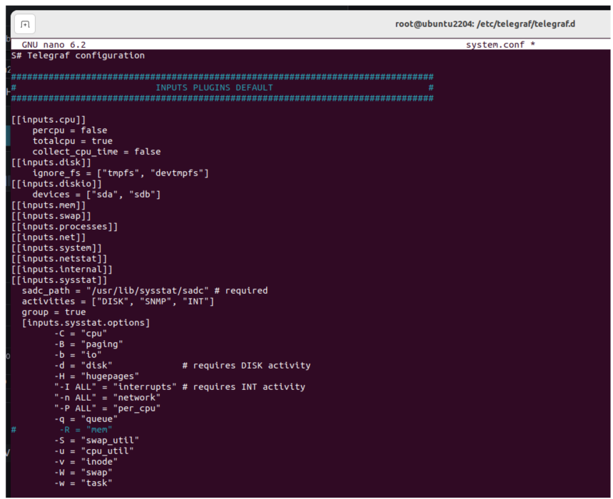

**Редактируем telegraf.conf** он лежит тут 

```bash
/etc/telegraf/telegraf.conf
# Это надо, чтобы агент понимал, куда ему складировать собранные метрики
```

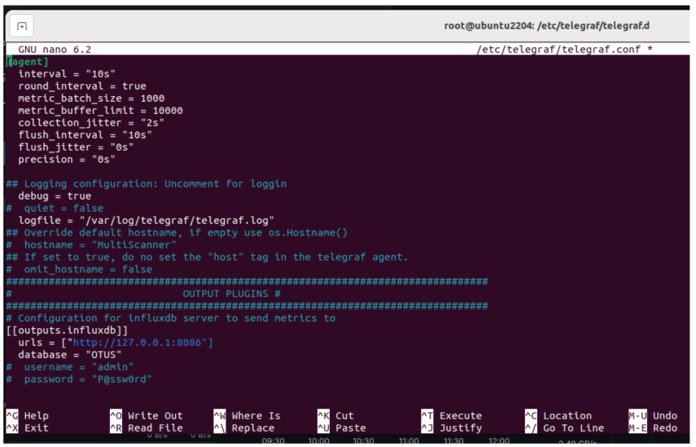


А тут, когда я захотел пойти на ui графаны, чтобы залогиниться и подключиться к базе, получил "страница не найдена". Удивился, полез смотреть статус сервиса и обнаружил, что саму графану я забыл установить :D
Поэтому устанавливаем. 

---
- Этап 3: Установка Grafana

```bash
# Скачиваем дистрибутив и устанавливаем (какой нашел, такой и установил) 

dpkg -i grafana-enterprise_10.2.3_amd64.deb

# Тут чего-то начало ругаться на зависимости
```

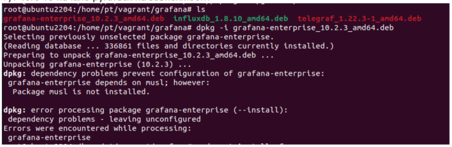


```bash
sudo apt install -f
```

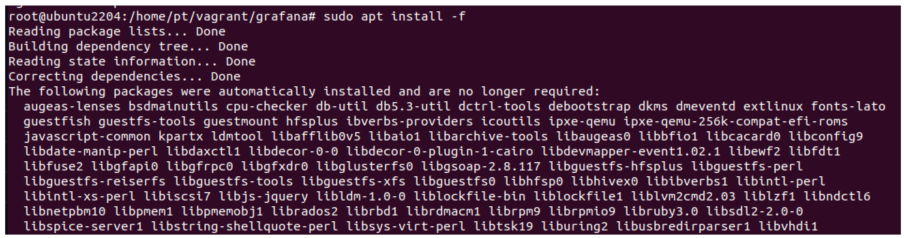
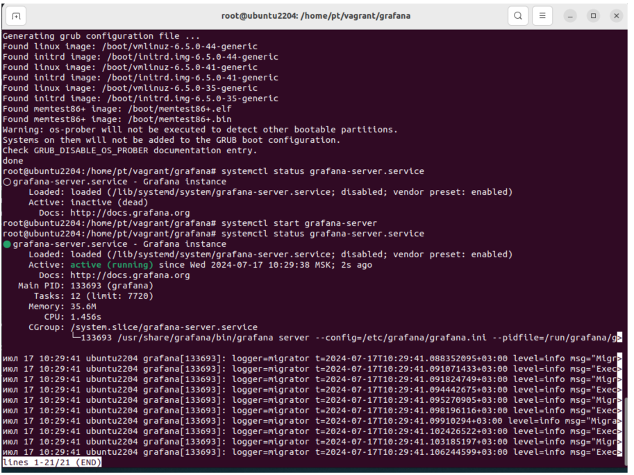

Вот теперь можно подключиться

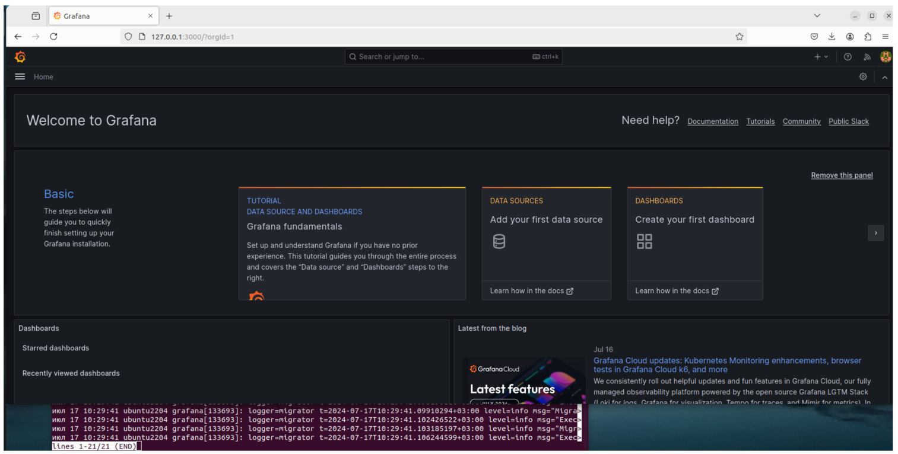

---
- Этап 4: Настраиваем Grafana

**Добавляем** нашу базу, куда телеграф складывает метрикит


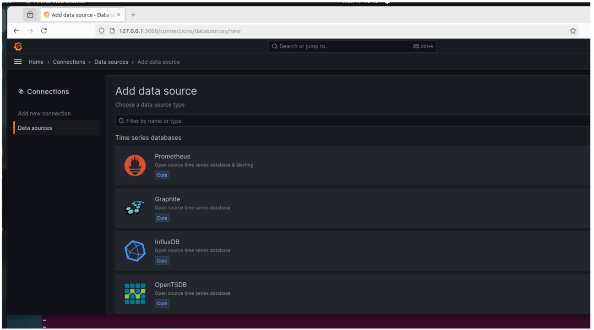
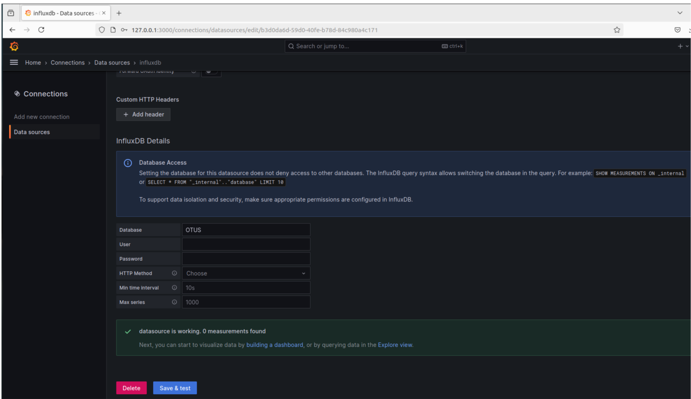


**Соединение с источником есть** но почему-то там нет ничего в самой БД. Понимаю, что кучу изменений внес, но не применил 

```bash
systemctl daemon-reload && systemctl restart telegraf.service
```

**Проверим**, что агент отрабатывает

```bash
telegraf --test --config /etc/telegraf/telegraf.d/system.conf
# Смотрим, есть ли ошибки, и вообще, отрабатывает ли что-то
```

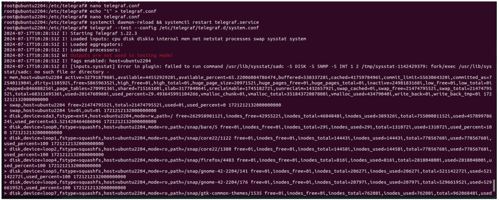


Теперь в БД **появились** метрики

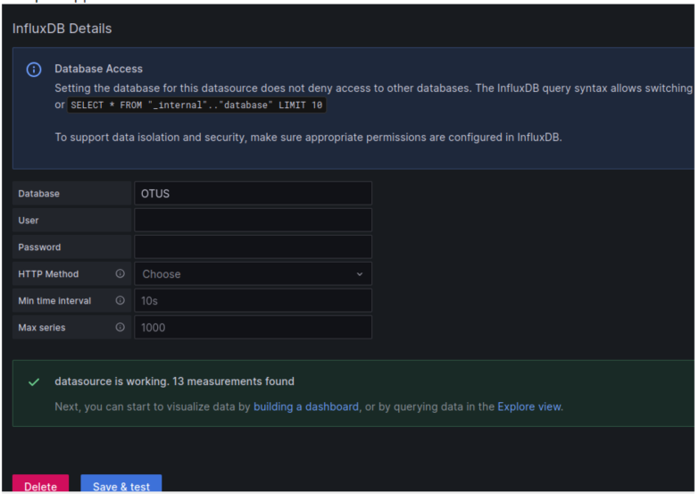


Ну и формируем **графики**, которые нам нужны

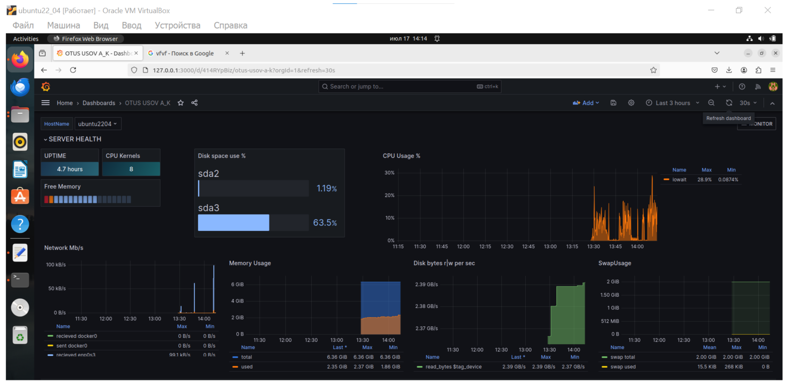


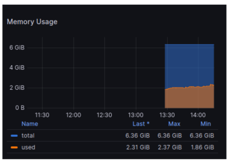

Что-то **погуглил**. На графике с сетью появилась информация


Что-то **сохранил на диск**. На графике заметен прирост

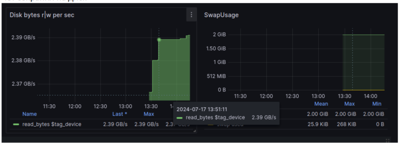


Дал системе постоять какое-то время, чтобы **собрать больше данных** и наполнить графики. 


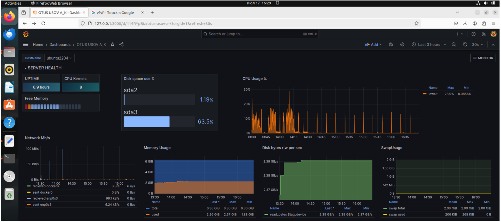


